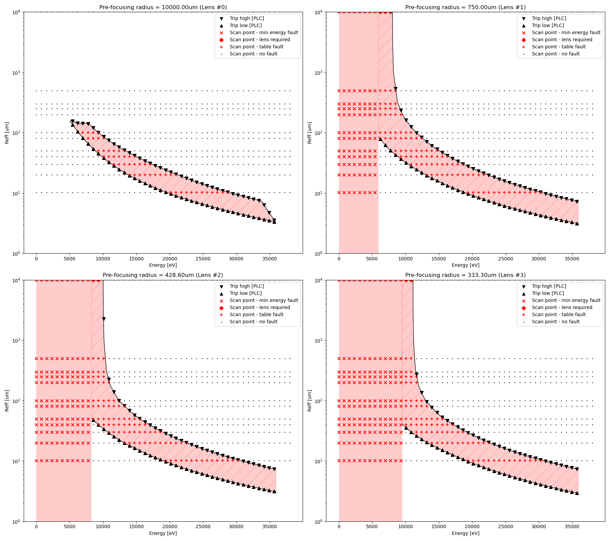

MFX Lens Interlock Automated Checkout Reports
=============================================

Notes
-----

* Data generation time is erroneously in GMT (please subtract 8 hours for accurate California time).

2022/05/05, 11:00 AM
--------------------

1. PLC code: R1.0.1 confirmed to be running
2. IOC code: R1.0.0 (in release area)
3. PCDS environment: v5.8.4
4. Transfocate: v0.5.5

Run on ``mfx-control``.

Packages installed in development mode:
* transfocate v0.5.5 (tagged)
* databroker v1.2.5 (>=2.0 is incompatible with this test)
* hutch-python v1.13.0-11-g18063d5 (unused for this test)

```
$ ipython -i -m transfocate.automated_checkout

...

Run scans and generate report? ('yes' to continue)
yes
Number of data points? Default: 50

Scanning with num_points=50...
```


[Report](report_20220505_1111.pdf)


2021/06/09, 3:38 PM
-------------------

1. PLC code: R1.0.1 confirmed to be running
2. IOC code: R1.0.0 (in dev area)
3. PCDS environment: v4.5.1
4. Transfocate: v0.5.1

Run on ``mfx-control``.

```
$ ipython -i -m transfocate.automated_checkout

...

Run scans and generate report? ('yes' to continue)
yes
Number of data points? Default: 50

Scanning with num_points=50...
```


[Report](report_20210609_1538.pdf)

20210609_1638
=============

1. PLC code: R1.0.1 confirmed to be running
2. IOC code: R1.0.0 (in release area)
3. PCDS environment: v4.5.1
4. Transfocate: v0.5.1


Run on ``mfx-control``.

```
$ ipython -i -m transfocate.automated_checkout

...

Run scans and generate report? ('yes' to continue)
yes
Number of data points? Default: 50
100
Scanning with num_points=100...
```


[Report](report_20210609_1638.pdf)

Took approximately 8 minutes from start to finish.

2022/11/09 10:24
================

1. PLC code: R1.0.1 confirmed to be running
2. IOC code: R1.0.0 (in release area)
3. PCDS environment: v4.5.1
4. Transfocate: v0.5.1

[Report](report_20221109_1024.pdf)

2023/07/12 15:56
================

1. PLC code: R1.0.1 confirmed to be running (hash ``0327f82``)
2. IOC code: R1.0.0 (in release area)
3. PCDS environment: v5.7.2
4. Transfocate: v0.5.7


Run on ``mfx-control``.

```
$ ipython -i -m transfocate.automated_checkout

...

Run scans and generate report? ('yes' to continue)
yes
Number of data points? Default: 50
100
Scanning with num_points=100...
```


[Report](report_20230712_1556.pdf)

20230926_1439
==============

1. PLC code: R1.0.1 confirmed to be running
2. IOC code: R1.0.0 (released)
3. PCDS environment: v5.7.3
4. Transfocate: v0.5.7

Run on ``mfx-control``.

```
$ ipython -i -m transfocate.automated_checkout
Run scans and generate report? ('yes' to continue)
yes
Number of data points? Default: 50
50
Scanning with num_points=50...

...

Generating report...
Wrote report to report_20230926_1439.pdf
```


[Report](report_20230926_1439.pdf)

20240820_1503
==============

1. PLC code: 
2. IOC code: R1.0.0
3. PCDS environment: 
4. Transfocate: 

Run on ````.

```
$ ipython -i -m transfocate.automated_checkout

...

((output here))
```


[Report](report_20240820_1503.pdf)

20250826_1231
==============

1. PLC code:  
2. IOC code: R1.0.0 
3. PCDS environment: v6.0.1
4. Transfocate: v0.5.9 

Run on mfx-mezz01 

```
$ ipython -i -m transfocate.automated_checkout

...

((output here))
```


[Report](report_20250826_1231.pdf)

20250908_1543
==============

1. PLC code: Master (after PLC replacement) 
2. IOC code: R1.0.0
3. PCDS environment: v6.0.1 
4. Transfocate: v0.5.9

Run on ``mfx-mezz01``.

```
$ ipython -i -m transfocate.automated_checkout

...

((output here))
```


[Report](report_20250908_1543.pdf)
